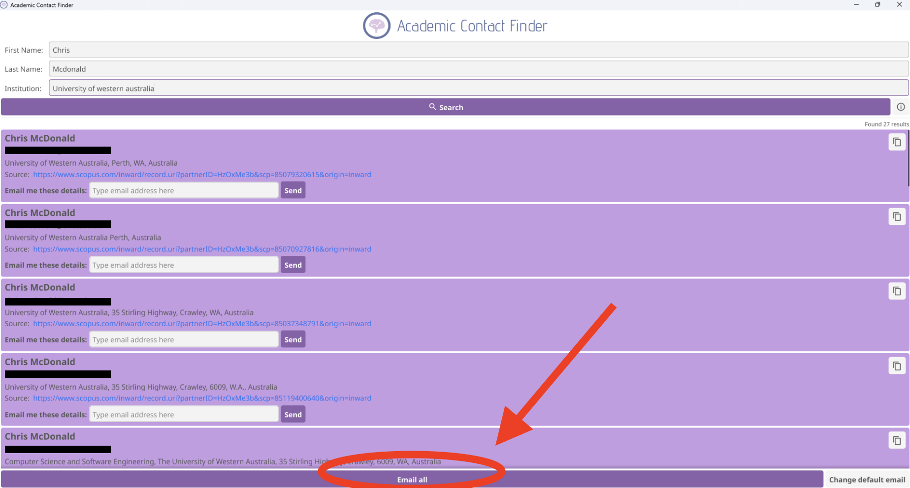

<h1 style="text-align: center; font-size: 70px; color: #6576A8;">User Guide</h1>

## Table of Contents

[TOC]

## 1. Introduction

Welcome to the **Academic Contact Finder**. This application is a user friendly way for finding email addresses of academic researchers, doctors, or professors. 

## 2. System Requirements 

- **Operating System**: Windows 10 or later, macOS 10.15 or later, Linux
- **Memory**: Minimum 4 GB RAM
- **Storage**: Minimum 100 MB of available space
- **Internet Connection**: Required for API requests and web scraping
- **API Key**: A valid Scopus API key **OR** A valid Google API key
  - If you provide both you be able to attain the most accurate results

## 3. Installation

### Download the Software

- visit the GitHub repository and download the latest version

### Launch the Software 

* After installataion, simply running the **.exe** file will open the application 

## 4. Initial Setup 

Upon the first time using the application, you will be prompted to enter your **Scopus API key** and your **Google API key**.

### Register for a Scopus API Key

1. Visit the site: https://dev.elsevier.com/index.jsp

2. You will be prompted to **Sign In** 

   * If you do not have an account, use your **academic institution details** to sign in. 
   * Scopus **does not** provide API keys if you are not part of an academic institution.

3. Click on "**I want an API Key**", as seen below

   

4. Click "**My API Key**" and you will then find your personal API key.

   

### Register for a Google API Key

1. 

### Enter API Keys into Application

1. Upon opening the application for the first time you will be prompted to enter both your **Scopus API key** and **Google API key**. 
2. **Copy and paste** the API keys into their respective fields.

3. Click the "**Save**" button to store your API keys. 

## 5. Using the App 

### Entering Researcher Details 

1. **Enter Name in Fields Provided**:
   - Provide first and last name for the most accurate results.
   - However, if only a last name is entered, the search will still be performed.
2. **Enter Institution Details**:
   - Provide the name for the researcher's institution if that information is known.

### Performing the Search

1. **Initiate Search**:
   - After entering the necessary details press the "Search" button.
2. **Processing**:
   - The app will perform API requests from "Scopus" first.
   - If limited results is found through this method it will automatically perform web scraping.

### Viewing Results 

1. **Review the Results**:
   - Once search is complete, the results will be displayed at the bottom of the screen.

2. **Order of Results**:
   - You may sort results in order based on publication dates. 

## 6. Emailing Results

1. **Setting Default Email Address**:
   - Press the button "Change default email address" to change your email which is currently entered.
   
2. **Email All Results**:
   - By pressing "Email All" at the bottom of the screen, you will then be allowed to select "Outlook". 
   
   - Once selected, you will be able to send all results that the app has found to your email address
   
     
   
3. **Send Individual Results**:
   - If you only wish to email yourself one of the results, simply press the "Send" button inside the result you wish to choose

## 7. Troubleshooting

#### hello

## 8. FAQs

