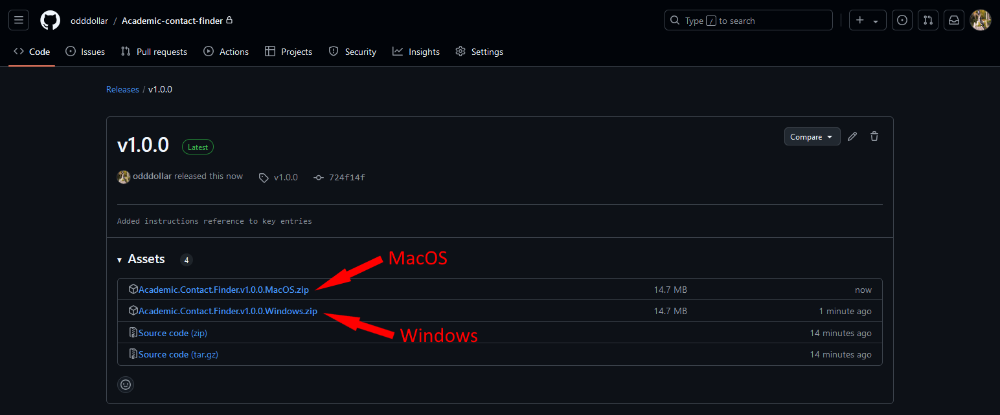

<h1 style="text-align: center; font-size: 70px; color: #6576A8; font-family: Futura; ">User Guide</h1>

## Table of Contents

[TOC]

## 1. Introduction

Welcome to the **Academic Contact Finder**. This application is a user friendly way for finding the contact details, including the title and email address, of academic researchers, doctors, and professors.

## 2. System Requirements

- **Operating System**: Windows 10 or later, macOS 10.15 or later.
- **Memory**: Minimum 4 GB RAM.
- **Storage**: Minimum 100 MB of available space.
- **Internet Connection**: Required for API requests and web scraping.
  - You must be connected to an **academic institution network** to obtain results from Scopus.
- **API Key**: A valid Scopus API key **and/or** a valid Google API key.
  - If you provide both keys, you will be able to obtain the most accurate results.

## 3. Installation

### Download the Release

1. Visit the GitHub repository using the following link.
   - https://github.com/odddollar/Academic-contact-finder
2. Click on the green **Latest** version release.

    

3. If you're using MacOS click the **.zip** file which shown below, the file will automatically download to your **Downloads** folder. Double click the **.zip** file to unzip it. If you're using Windows, click the **.exe** file as seen below. Similarly, this will automatically download to your **Downloads** folder, however, you won't have to unzip it.

    

### Launch the Software

- Whether you're on Mac or Windows, simply double click the application to launch it.
- If a Windows SmartScreen notification appears saying **Windows protected your PC**, click **More info**, then **Run anyway**.

## 4. Initial Setup

The first time you open the application, you will be prompted to enter your **Scopus API key** and your **Google API key**.

If you have already been provided with a Scopus API key, you can skip the **Register for a Scopus API Key** step below and proceed to the **Register for a Google API Key** step.

### Register for a Scopus API Key

> [!NOTE]
>
> Scopus only provides API keys if you are part of an academic institution, such as a research facility or university.

1. Visit the site: https://dev.elsevier.com/index.jsp
2. You will be prompted to **Sign In**.
   - If you do not already have a registered account, use your academic institution details to sign in.
3. Click **I want an API Key**, then **Create API Key**.

   

4. Give the key a **Label**, and enter a relevant **Website URL**, such as a company website address. Read/accept the terms and conditions, then click **Submit**.

   

5. Click **My API Key**, where you will then find your personal API key.

   

6. This API key will be valid for 1 year.

### Register for a Google API Key

1. Visit the site: https://developers.google.com/custom-search/v1/introduction
2. Click the **Programmable Search Engine** hyperlink.

   

3. Click **Get Started** once taken to the next page.
4. You will now be prompted to **Create a new search engine**. You may name this whatever you wish, ensuring you select **Search the entire web**. You can now click **Create**.

   

5. Once you have created your new search engine, click **Customize**.
6. Copy the **Search engine ID**.

   

7. Navigate back to the original page and click **Get A Key**.

   

8. You will be prompted to **Select or create project**. Create a project and name this whatever you wish. Read/accept the terms and conditions, then click **Next**.

   

9. Click on **Show Key** and copy the key.

   

### Enter API Keys into Application

1. The first time you open the application, you will be prompted to enter your **Scopus API key** as seen below. Press **Save** once you have entered your key.

   

2. You will then be prompted to enter your Google **Search engine ID** and **API key** in their respective fields. Press **Save** once you have entered these in.

   

3. These details will be saved to your local computer so they don't have to be entered every time the application is opened. If a problem is detected with an API key (such as it having expired), then the prompt to enter that key will appear again.
4. You can also enter the default email address to use to send found results to.

    

## 5. Using the App

### Performing the Search

1. Enter the desired person's details in the fields provided. Provide the first and last name, and the person's institution to return the most accurate results. The search will still be performed if only the last name is entered.

   

2. After entering the necessary details, click the **Search** button.
3. The app will perform the API requests from Scopus first. After Scopus has been searched, the app will automatically start searching Google. A browser window will open while the application searches the web. This is normal and does not have to be interacted with.

### Viewing Results

1. Once the search has completed, the results will be displayed in the program window.
2. All results returned by Scopus will contain the most recent results first. All results returned by Google will be shown after the Scopus results, and will be returned in order of how they were found based on Google's Search Engine Optimisation (SEO).
   - The results can be reversed with thebutton.

## 6. Emailing Results

1. If desired, click the **Change default email** button to change the email initially entered.

   

2. To send all the found results as a single email to the default address, click the **Email all** button. The default email application will be opened, containing a prefilled draft email with all contact details returned from the search. Click **Send**.
   - If using Windows, multiple mail application options may appear. We have tested and found that Outlook works the most reliably, but other options may work too.
   
   
   
3. If you only wish to send one of the results to the specified email, click on the **Send** button inside of the result you wish to choose. The default email application will again be opened, containing a prefilled draft email with only that result's details. Click **Send**.
   
   

## 7. FAQs

**What is an API key?**

An API key is a unique identifier used to authenticate a user, developer, or program to an API (Application Programming Interface). It allows our application to communicate with external services, namely Scopus and Google, and access data based on the permissions granted by the key.

**Why do I need an API key?**

You will need an API key to access the data from Scopus and Google that provides the contact details of academics. The API keys verify that our application has the proper authorisation to use these services, ensuring security and monitoring usage.

**Why do I need two different API Keys?**

Different services require their own API keys for access. The Scopus API key allows our application to search for academic details within the Scopus database, while the Google API key is used to find publicly available information through Google Search. Each service has its own API and needs its own key for interaction.

For best results, both API keys should be provided, and a Google key is mandatory.

**What do I do when the Scopus API key expires?**

As the Scopus API key is only valid for 1 year, a new key will have to be generated once it expires. The program will prompt you for a new key if the entered key is invalid or has expired.

**Should I be sharing my Google API key with others?**

No, you should not share your Google API key with others. Sharing your API key can expose your account to security risks. For this reason, it is important to keep your API key private.

If others wish to use the **Academic Contact Finder**, they will need to generate their own Google API key by following the instructions provided above.

**How up to date is the information provided?**

Whilst our application aims to provide the most up-to-date information for each academic, it will only return results available on Scopus or Google. This does not guarantee that all information is current.

**How accurate is the information provided?**

While our application aims to provide the most accurate information for each academic, it can only return results found on Scopus or Google.

There may be instances where the associated email appears incorrect. Since we provide the source from which the details were obtained, this can be manually verified.

**How does the application find contact details?**

The application uses a combination of API calls and web scraping to gather publicly available information from Scopus, an academic database, and websites online.

**Is the data I input stored or shared?**

No, the data you input is not stored or shared. The application processes your input only temporarily to search for contact details. Once the search is completed and the results are delivered, the input data is not retained or shared. The entered API keys are stored, but only on the computer the program is running on, and are never shared. This means that you don't have to enter these keys every time the program is opened.

**Is there a limit to how many searches I can perform?**

While there is no limit to how many searches can be performed with a Scopus API key, the Google API key is limited to 100 search queries per day for free. You can pay Google for additional usage if required.

**Is there any way to copy the results directly to my clipboard?**

Yes, clicking the clipboard icon  on the right-hand side of the results will copy a formatted version of that result to your clipboard.

**Can I search for researchers worldwide, or are there geographic restrictions?**

The application can search for researchers globally, provided that their contact information is publicly available by the services used.

**Why can't I find the researcher's contact details?**

If the researcher's contact details are not publicly accessible or listed in Scopus or Google, the application will not be able to retrieve the information.

Otherwise, ensure that the information you have entered in the search fields is spelt correctly and uses the researcher's most commonly used name as opposed to nicknames. For institutions, use the full name of the institution rather than abbreviations. For example, enter the 'University of Western Australia' instead of 'UWA'.

**Which Wi-Fi network should I be connected to in order to use this?**

To access results from Scopus, you will need to be connected to a Wi-Fi network that provides access to Scopus, such as your office or institutional network. If you are not connected to such a network, the **Academic Contact Finder** will only return the results found using Google Search.

**Why is the application opening up a browser window?**

As the application searches both Scopus and the web for results, a browser window will appear. You do not have to interact with this window as this is the application automatically conducting the search process. You can continue using your computer as normal.
