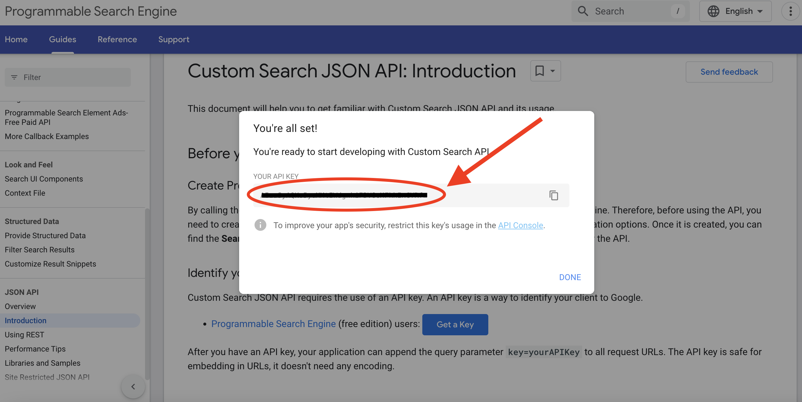

<h1 style="text-align: center; font-size: 70px; color: #6576A8; font-family: Futura; ">User Guide</h1>

## Table of Contents

[TOC]

## 1. Introduction

Welcome to the **Academic Contact Finder**. This application is a user friendly way for finding email addresses of academic researchers, doctors, or professors.

## 2. System Requirements

- **Operating System**: Windows 10 or later, macOS 10.15 or later, Linux
- **Memory**: Minimum 4 GB RAM
- **Storage**: Minimum 100 MB of available space
- **Internet Connection**: Required for API requests and web scraping
  - You must be connected to an **academic institution network** to attain results from Scopus.  

- **API Key**: A valid Scopus API key **AND/OR** A valid Google API key
  - If you provide both you be able to attain the most accurate results

## 3. Installation

### Download the Software

- visit the GitHub repository and download the latest version

### Launch the Software

* After installataion, simply running the **.exe** file will open the application

## 4. Initial Setup

Upon the first time using the application, you will be prompted to enter your **Scopus API key** and your **Google API key**.

If you have already been provided with a Scopus API key you can skip the **Register for a Scopus API Key** step. 

### Register for a Scopus API Key

1. Visit the site: https://dev.elsevier.com/index.jsp

2. You will be prompted to **Sign In**

   * If you do not have an account, use your **academic institution details** to sign in.
   * Scopus **does not** provide API keys if you are not part of an academic institution.

3. Click on "**I want an API Key**", as seen below

   

4. Click "**My API Key**" and you will then find your personal API key.

   

5. This API key will only be **valid for 1 year**!

### Register for a Google API Key

1. Visit the site: https://developers.google.com/custom-search/v1/introduction

2. Click the "**Programmable Search Engine**" hyperlink as seen below:

   

3. Press "**Get Started**" once taken to the next page.
4. You will now be prompted to **create a new search engine**. You man name it anything you wish, however, ensure you select **search the entire web**. You can now press "**create**".

​	

5. Once you have created your new search engine click "**customize**".

6. Copy the **Search Engine ID** as seen below since this is required.

   

6. Navigate back to the original page and click "**Get A Key**" as seen below.	

   

7. You'll be prompted to **create a new project**, you may name this whatever you wish. Select "**Yes**" to agreeing to terms of service, then click **Next**. 

   

8. Now press on "**Show Key**" and **copy** the key since you'll need it for the application.	

   

### Enter API Keys into Application

1. Upon opening the application for the first time you will first be prompted to enter your **Scopus API key** as seen below. Press "**Save**" once you have **copy and pasted** your key.

   

2. You will then be prompted to enter your Google **Search engine ID** and **API key** in their respective fields. Press "**Save**" once you have **copy and pasted** these values in.

   

3. The application now has all the API details it requires to function. 

## 5. Using the App

### Entering Researcher Details

1. **Enter Name in Fields Provided**:
   - Provide first and last name for the most accurate results.
   - However, if only a last name is entered, the search will still be performed.
   
2. **Enter Institution Details**:
   
   - Provide the name for the researcher's institution if that information is known.
   
     

### Performing the Search

1. **Initiate Search**:
   - After entering the necessary details press the "Search" button.
2. **Processing**:
   - The app will perform API requests from "Scopus" first.
   - If limited results is found through this method it will automatically perform web scraping.
   - A browser window will open while the application searches the web. 

### Viewing Results

1. **Review the Results**:
   - Once search is complete, the results will be displayed at the bottom of the screen.

2. **Order of Results**:
   - All results returned by **Scopus** will contain the **most recent** results first.
   - All results attained from **web scraping** will be shown after the Scopus results and will be ordered based on how they're found using **Google's SEO**. 

## 6. Emailing Results

1. **Setting Default Email Address**:
   - Press the button "Change default email address" to change your email which is currently entered.

     
   
2. **Email All Results**:
   - By pressing "Email All" at the bottom of the screen, If you're using a **Mac** the mail app will open with the email laid out in a similar format to the display on the application. If you're using **Windows**, a few options will appear, you must select **Outlook** before you can send the email. 

   - Once selected, you will be able to send all results that the app has found to your email address.

     

3. **Send Individual Results**:
   - If you only wish to email yourself one of the results, simply press the "Send" button inside the result you wish to choose.
   
   - Similarly to the email all functionality, if you're using **Mac**, the mail app will open and allow you to send the result that way. If using **Windows**, you must select **Outlook** before being able to send the results to yourself.
   
     

## 7. FAQs

- **What is an API key?**

    An API key is a unique identifier used to authenticate a user, developer, or program to an API (Application Programming Interface). It allows our application to communicate with external services, namely Scopus and Google, and access data based on the permissions granted by the key.

- **Why do I need an API key?**

    You will need an API key to access the data from Scopus and Google that provides the contact details of researchers. The API keys verify that our application has the proper authorisation to use these services, ensuring security and monitoring usage.

- **Why do I need two different API Keys?**

    Different services require their own API keys for access. The Scopus API key allows our application to search for researcher details within the Scopus database, while the Google API key is used to find publicly available information through Google Search. Each service has its own API and needs its own key for interaction.

    For best results, both API keys should be provided.

- **Should I be sharing my Google API key with others?**

    No, you should not share your Google API key with others. Sharing your API key can expose your account to security risks. For this reason, it is important to keep your API key private.

    If others wish to use the ‘Academic Research Finder,’ they will need to generate their own Google API key by following the instructions provided above.

- **How up to date is the information provided?**

    While our application aims to provide the most up-to-date information for each researcher, it will only return results from Scopus or Google. This does not guarantee that all information is current.

- **How accurate is the information provided?**

    While our application aims to provide the most accurate information for each researcher, it can only return results found from Scopus or Google.

    There may be instances where the associated email appears incorrect. Since we provide the source from which the details were obtained, this can be manually verified.

- **How does the application find contact details?**

    The application uses a combination of API calls and web scraping to gather publicly available information from Scopus, an academic database, and websites online.

- **Is the data I input stored or shared?**

    No, the data you input is not stored or shared. The application processes your input only temporarily to search for contact details. Once the search is completed and the results are delivered, the input data is not retained or shared.

- **Is there a limit to how many searches I can perform?**

    While there is no limit to how many searches can be performed by Scopus API key, the Google API key is limited to 100 search queries per day for free.

- **Is there any way to copy the results directly to my clipboard?**

    Yes, clicking the clipboard icon on the right-hand side of the results will copy a formatted version of the results to your clipboard.

- **Can I search for researchers worldwide, or are there geographic restrictions?**

    The application can search for researchers globally, provided that their contact information is publicly available by the services used.

- **Why can’t I find the researchers' contact details?**

    If the researcher's contact details are not publicly accessible or listed in Scopus, the application will not be able to retrieve the information.

    Otherwise, ensure that the information you have entered in the search fields is spelt correctly and uses the researchers full name as opposed to nicknames. For institutions, use the full name of the institution rather than abbreviations. For example, enter the ‘University of Western Australia’ instead of ‘UWA.’

- **Which Wi-Fi network should I be connected to in order to use this?**

    To access results from Scopus, you need to be connected to a Wi-Fi network that provides access to Scopus, such as your office network. If you are not connected to such a network, the ‘Academic Contact Finder’ will return results from Google Search instead.
    
- **Why is the application opening up a browser window?**

    As the application searches both Scopus and the web for results, a browser window will appear. You do not have to interact with this window since it is simply the application automatically conducting the search process. 
